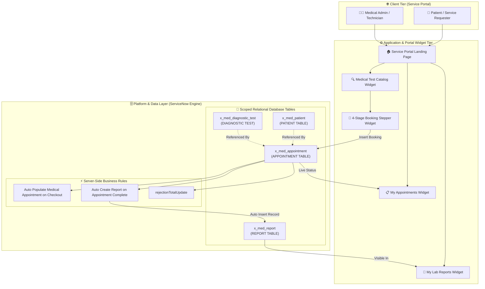
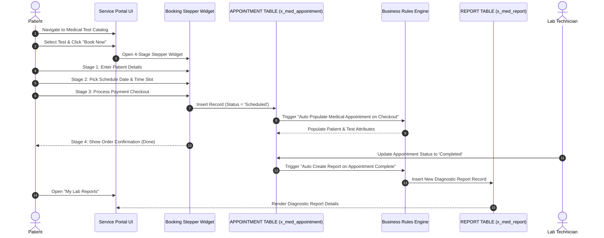
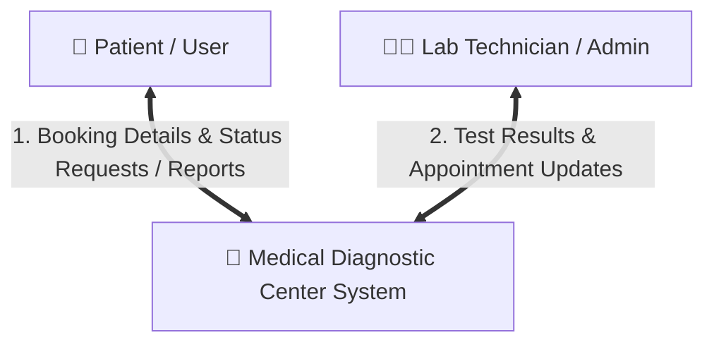
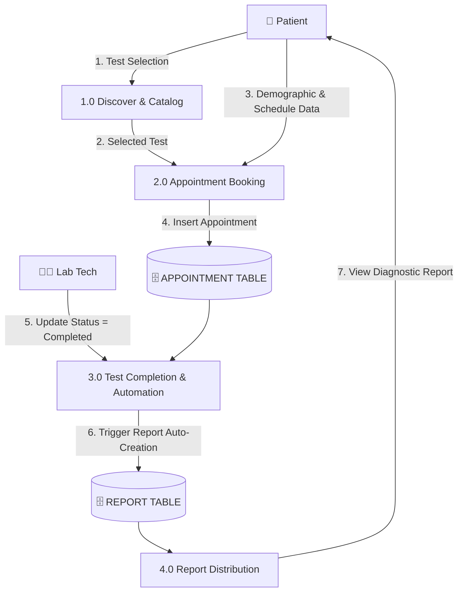
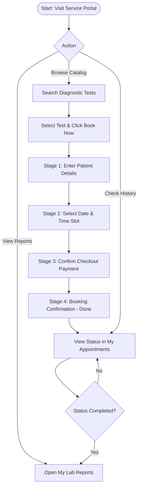
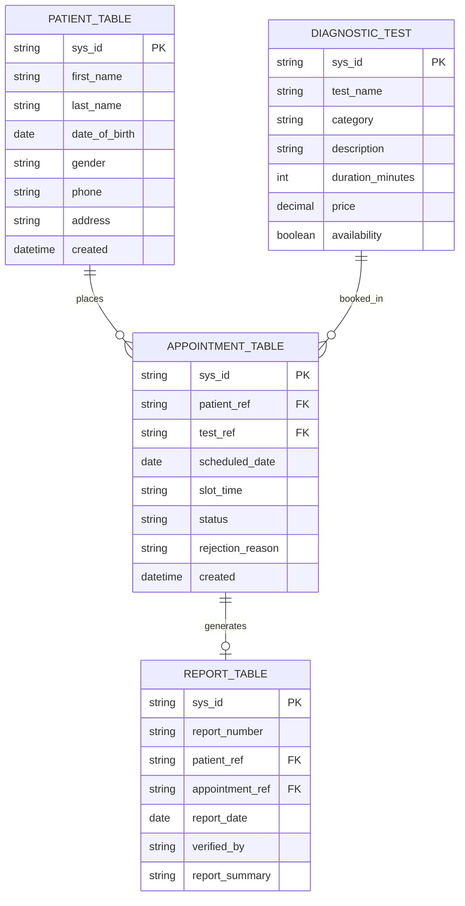
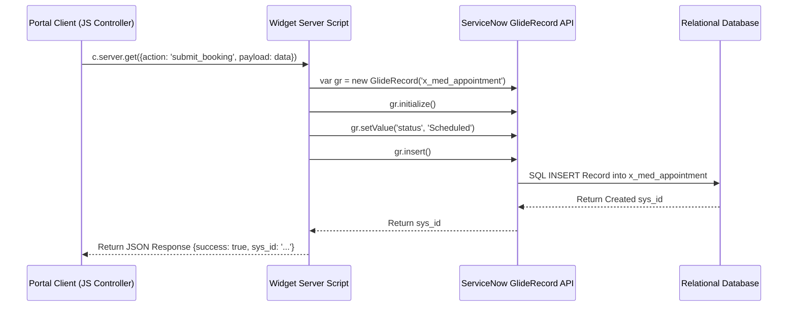
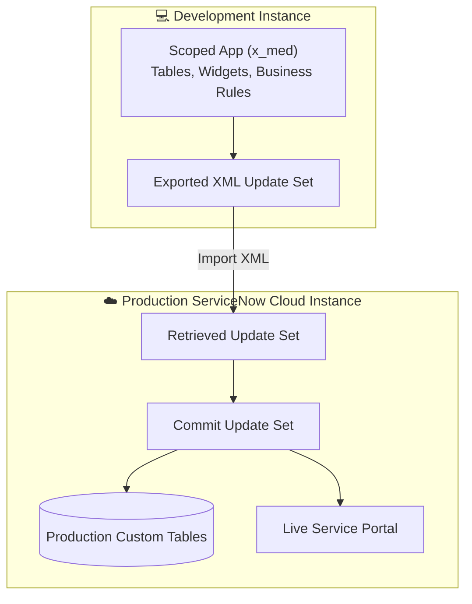

## 1. Project Title
**Medical Diagnostic Center by ServiceNow Service Portal**  
*(An Automated Healthcare Request, Appointment Scheduling, and Diagnostic Report Management Solution)*

---

## 2. Abstract / Project Overview
The **Medical Diagnostic Center by ServiceNow Service Portal** is an enterprise-aligned healthcare digital transformation solution built on the **ServiceNow** platform. The system addresses critical inefficiencies in traditional healthcare management—such as fragmented diagnostic test ordering, manual appointment scheduling, delayed status updates, and physical report collection.

By leveraging ServiceNow Service Portal widgets, scoped relational tables, and server-side Business Rules, this solution provides patients with a unified self-service portal. Patients can search for medical tests, complete a guided 4-stage appointment booking wizard (**Details** → **Schedule** → **Payment** → **Done**), monitor appointment status in real time, and securely access medical diagnostic reports. The platform operates natively within ServiceNow without relying on external frontend/backend stacks or external hospital EHR frameworks.

---

## 3. Problem Statement
Traditional healthcare service workflows often suffer from:
1. **Fragmented Patient Touchpoints:** Patients must make phone calls, visit facilities physically, or use disconnected channels to book diagnostic tests and inquire about schedules.
2. **Manual & Error-Prone Record Keeping:** Paper-based or un-automated appointment logs lead to scheduling conflicts, lost patient data, and delayed diagnostic processing.
3. **Lack of Real-Time Status Visibility:** Requesters lack self-service tracking tools to view whether an appointment is scheduled, in progress, completed, or rejected.
4. **Delayed & Insecure Report Distribution:** Medical lab reports require manual handover or physical pickup, increasing turnaround time and creating data privacy concerns.

---

## 4. Objectives
- **Centralize Patient Self-Service:** Create an intuitive Service Portal for test discovery, booking, status tracking, and report retrieval.
- **Automate Appointment Processing:** Implement server-side ServiceNow Business Rules (`Auto Populate Medical Appointment on Checkout`) to map booking details automatically upon checkout.
- **Automate Diagnostic Report Generation:** Trigger automatic report creation (`Auto Create Report on Appointment Complete`) in the `REPORT TABLE` upon medical test completion.
- **Enforce Data Security & Compliance:** Configure Role-Based Access Control (RBAC) and row-level Access Control Lists (ACLs) to segregate patient medical records.
- **Deliver an Evaluation-Ready Prototype:** Provide complete traceabilities, Agile sprint documentation (MDC-1 to MDC-12), UAT verification reports, and FSD specifications.

---

## 5. Proposed Solution
The proposed solution implements a complete healthcare management workflow on ServiceNow:
- **Service Portal UI Layer:** A responsive web application built with AngularJS widgets, HTML5, and CSS3.
- **Guided 4-Stage Stepper Widget:** A multi-step booking form capturing patient details, scheduling dates/slots, processing payment checkout, and generating order confirmations.
- **Custom Scoped Database Layer:** Four relational ServiceNow tables (`PATIENT TABLE`, `DIAGNOSTIC TEST`, `APPOINTMENT TABLE`, and `REPORT TABLE`).
- **Server-Side Automation:** Event-driven Business Rules handling checkout mapping, auto-report creation, and rejection tracking.

---

## 6. Key Features
- **Medical Test Catalog:** Search and filter diagnostic tests by category, price, duration, and availability.
- **Interactive 4-Stage Stepper:**
  - `Stage 1 (Details)`: Demographic capture (First/Last Name, DOB, Phone, Address, Gender).
  - `Stage 2 (Schedule)`: Dynamic appointment date and slot time selection.
  - `Stage 3 (Payment)`: Simulated payment checkout validation.
  - `Stage 4 (Done)`: Order finalization and reference code generation.
- **My Appointments Dashboard:** Real-time lifecycle tracking (`Scheduled`, `In Progress`, `Completed`, `Rejected`).
- **Automated Report Creation:** Instant report generation upon setting appointment status to `Completed`.
- **My Lab Reports View:** Secure patient access for viewing and downloading diagnostic test results.
- **Row-Level Security:** ACL policy ensuring patients access only their own records.

---

## 7. Technology Stack

| Layer | Technology / Tool | Version / Details |
| :--- | :--- | :--- |
| **Enterprise Platform** | ServiceNow Cloud Platform | San Diego / Utah / Washington DC |
| **Frontend Framework** | Service Portal Engine | AngularJS, HTML5, Vanilla CSS3, JavaScript ES6 |
| **Backend / Server Logic** | ServiceNow Server-Side Engine | JavaScript (GlideRecord API, Business Rules) |
| **Database Engine** | ServiceNow Relational Storage | Custom Scoped Relational Glide Tables |
| **Security & RBAC** | ServiceNow ACLs & Roles | `canvas_user`, `admin`, `patient_user`, `lab_technician` |
| **Development Methodology**| Agile Scrum | 3 Sprints (Sprints 1-3, MDC-1 to MDC-12) |

---

## 8. System Requirements

### Developer / Admin Environment
- **Platform Access:** ServiceNow Developer / Enterprise Instance (`https://<instance-name>.service-now.com`)
- **Browser:** Google Chrome v100+, Mozilla Firefox v100+, or Microsoft Edge (Latest)
- **Role Permissions:** System Administrator (`admin`) role for Update Set import and table configuration.

### Client / Patient Environment
- **Device Support:** Desktop, Tablet, or Mobile Web Browsers.
- **Network Requirement:** Internet connectivity with HTTPS enabled (Port 443).

---

## 9. System Architecture

The architecture follows a classic 3-tier enterprise pattern adapted for the ServiceNow platform:



### Explanation of System Architecture
- **Client Tier:** Serves the frontend web pages to patients and healthcare personnel via standard browsers.
- **Application Tier:** Houses ServiceNow Service Portal widgets that manage state, patient form interactions, and navigation.
- **ServiceNow Platform Tier:** Executes backend JavaScript logic via Business Rules and maintains relational database integrity across four custom scoped tables (`x_med_*`).

---

## 10. Complete Project/Folder Structure

```text
SERVICENOW/
│
├── 📁 2.REQUIREMENT ANALYSIS/                    # Requirements & User Stories
│   ├── Customer Journey Map.docx / .pdf          # Patient touchpoints & experience mapping
│   ├── Data Flow Diagrams and User Stories.docx / .pdf # DFD Level 0/1/2 & functional stories
│   ├── Solution Requirements.docx / .pdf         # System requirements & constraints
│   └── Technology Stack.docx / .pdf              # ServiceNow platform architecture
│
├── 📁 3.PROJECT DESIGN PHASE/                    # Design Solutions & System Architecture
│   ├── 📁 Problem Solution/                      # Problem statement & technical solution
│   │   ├── Problem - Solution.docx / .pdf
│   │   └── Project Design Phase.docx / .pdf
│   ├── 📁 Proposed Solution/                     # Service portal layout design
│   │   ├── Project Design Phase.docx / .pdf
│   │   └── Proposed_Solution Template.docx / .pdf
│   └── 📁 Solution Architecture/                 # System diagrams & data model design
│       └── Solution Architecture.docx / .pdf
│
├── 📁 4.PROJECT PLANNING PHASE/                  # Project Management & Schedules
│   ├── Network Request Planning Logic.docx / .pdf # Workflow logic & WBS decomposition
│   └── Network Request Project Planning.docx / .pdf # Sprint Backlog (MDC-1 to MDC-12) & Gantt Schedule
│

├── 📁 5.PROJECT DEVELOPMENT PHASE/               # Development, Ideation & Test Evidence
│   ├── 📁 1.IDEATION PHASE/                      # Problem framing & empathy maps
│   │   ├── Brainstorming- Idea Generation- Prioritizaation Template.docx / .pdf
│   │   ├── Define Problem Statements Template.docx / .pdf
│   │   └── Empathy Map Canvas.docx / .pdf        # Patient & medical staff empathy mapping
│   ├── 📁 Performance Testing/                   # Performance & Platform Verifications
│   │   ├── Functional Performance Testing.docx / .pdf # Core workflow load & speed test
│   │   ├── Salesforce Template ServiceNow Equivalent.docx / .pdf # Platform comparison
│   │   ├── User Acceptance Testing UAT.docx / .pdf # Initial UAT execution test cases
│   │   ├── Artificial Intelligence Model Performance.docx / .pdf (Out of Scope / N/A)
│   │   ├── Machine Learning Model Performance.docx / .pdf (Out of Scope / N/A)
│   │   ├── Power BI Performance.docx / .pdf (Out of Scope / N/A)
│   │   └── Tableau Performance.docx / .pdf (Out of Scope / N/A)
│   └── 📁 User Acceptance Testing/               # Final Release Acceptance Sign-off
│       ├── UAT Execution Report.docx / .pdf      # Final test case pass matrix
│       └── UAT Report.docx / .pdf                # Release readiness summary
│
├── 📁 6.PROJECT DOCUMENTATION/                   # Final Specifications & Technical Reports
│   ├── Final Project.docx / .pdf                 # Comprehensive project final report
│   ├── Functional Specification Document.docx / .pdf # Complete technical FSD (v1.0)
│   └── README.md                                 # Primary Documentation README
│
├── 📁 7.PROJECT DEMONSTRATION/                   # Visual Demonstration & Evidence
│   └── Project Demonstration.docx / .pdf         # Step-by-step visual demonstration guide
│
├── 📁 WORKFLOW/                                  # End-to-End Reference Workflow
│   ├── Complete End to End Workflow.docx / .pdf  # 21-page master reference guide
│   └── README.md                                 # Workflow specification README
│
└── 📄 README.md                                  # Primary Root Project README
```

---

## 11. Explanation of Every Important Folder and File

- **`2.REQUIREMENT ANALYSIS/`**: Captures patient journey touchpoints, DFD levels 0-2, functional/non-functional requirements, and technology stack definitions.
- **`3.PROJECT DESIGN PHASE/`**: Contains architectural blueprints, solution design specifications, and database schema mappings.
- **`4.PROJECT PLANNING PHASE/`**: Defines the Agile Sprint backlog containing 12 key user stories (**MDC-1 to MDC-12**) across 3 Sprints.
- **`5.PROJECT DEVELOPMENT PHASE/`**:
  - `1.IDEATION PHASE/`: Brainstorming canvases, problem statements, and empathy maps.
  - `Performance Testing/`: Test records validating portal response times, platform equivalencies, and scoping notes (AI/ML/Power BI marked N/A).
  - `User Acceptance Testing/`: Final UAT Execution Report verifying all test cases passed without open defects.
- **`6.PROJECT DOCUMENTATION/`**: Formal **Functional Specification Document (FSD)** and **Final Project Report** used for academic evaluation.
- **`7.PROJECT DEMONSTRATION/`**: Step-by-step demonstration guide with screenshot references.
- **`WORKFLOW/`**: Master 21-page reference detailing the 11-step end-to-end operational lifecycle.

---

## 12. System Workflow

```mermaid
graph LR
    Step1["1. Portal Landing"] --> Step2["2. Search Test Catalog"]
    Step2 --> Step3["3. Click Book Now"]
    Step3 --> Step4["4. Fill Patient Details"]
    Step4 --> Step5["5. Select Schedule Slot"]
    Step5 --> Step6["6. Complete Payment Checkout"]
    Step6 --> Step7["7. Order Confirmation (Done)"]
    Step7 --> Step8["8. View in My Appointments"]
    Step8 --> Step9["9. Diagnostic Test Completed"]
    Step9 --> Step10["10. Auto Generate Lab Report"]
    Step10 --> Step11["11. View Report in My Lab Reports"]
```



### Workflow Description
The system guides the patient seamlessly from landing page test discovery to booking completion. Server-side triggers then listen for appointment status changes to automate diagnostic report creation without manual administrative intervention.

---

## 13. Application Flow



### Explanation of Application Flow
This sequence diagram illustrates the step-by-step communication between the Patient, Service Portal Widgets, ServiceNow Database Tables, Business Rules, and Lab Technicians.

---

## 14. Data Flow Diagram (DFD)

### DFD Level 0 (Context Diagram)



### DFD Level 1 (Process Breakdown)



---

## 15. User Flow



---

## 16. Database Architecture / ER Diagram



---

## 17. API Architecture and API Flow

ServiceNow uses internal JavaScript API handlers for Service Portal widget server communications and GlideRecord database triggers:



---

## 18. Module-wise Explanation

### 1. Medical Test Catalog Module
- **Purpose:** Allows patients to search, filter, and discover diagnostic tests.
- **Key Fields:** Test Name, Category, Description, Duration, Price, Availability.
- **Action:** Clicking "Book Now" opens the 4-stage booking stepper.

### 2. Appointment Booking Module
- **Purpose:** Multi-step stepper wizard guiding patients through booking checkout.
- **Stages:** `Details` -> `Schedule` -> `Payment` -> `Done`.

### 3. My Appointments Module
- **Purpose:** Real-time patient dashboard tracking booking history and live statuses.

### 4. ServiceNow Business Rules Automation Module
- **`Auto Populate Medical Appointment on Checkout`**: Maps patient demographics and test parameters on insertion.
- **`Auto Create Report on Appointment Complete`**: Creates a linked report record when status reaches `Completed`.
- **`rejectionTotalUpdate`**: Maintains rejection audit details.

### 5. My Lab Reports Module
- **Purpose:** Secure report repository enabling patients to download completed diagnostic lab results.

---

## 19. Frontend Architecture
- **Framework:** ServiceNow Service Portal (AngularJS 1.x / ES6 Engine).
- **Styling:** Custom Vanilla CSS3 with responsive grid layout.
- **Widget Components:**
  - `med_test_catalog_widget`: Catalog grid & search.
  - `appointment_booking_stepper_widget`: 4-stage wizard modal.
  - `my_appointments_widget`: Transactional history list.
  - `my_lab_reports_widget`: Lab report viewer.

---

## 20. Backend Architecture
- **Server Platform:** ServiceNow Java Virtual Machine (JVM) Application Server.
- **Scripting Engine:** Server-Side JavaScript (Mozilla Rhino / ECMAScript 2021).
- **Data Access:** ServiceNow `GlideRecord` ORM engine handling queries, inserts, and updates safely.

---

## 21. AI/ML Architecture
**Status:** **N/A (Out of Scope / Not Implemented)**  
*As explicitly documented in the Performance Testing artifacts (`Artificial Intelligence Model Performance.docx` & `Machine Learning Model Performance.docx`), autonomous AI/ML diagnostic prediction is N/A for this release. All diagnostic evaluations remain under qualified medical professionals.*

---

## 22. Authentication and Security
- **Authentication:** ServiceNow System Authentication (SSO / Local Database Auth).
- **Configured System Roles:**
  - `admin`: Full configuration and system administration.
  - `canvas_user` / `patient_user`: Portal requester access for booking and viewing own reports.
  - `lab_technician`: Medical operational role for updating appointment statuses.
- **Access Control Lists (ACLs):** Row-level security rules enforcing that patients can query only records where `patient_ref == gs.getUserID()`.

---

## 23. Dashboard Explanation

### My Appointments & My Lab Reports Dashboard
- **Purpose:** Provide patients with a self-service operational view.
- **Navigation:** Header menu links (`Medical Test Catalog`, `My Appointments`, `My Lab Reports`).
- **Data Displayed:** Appointment Reference ID, Scheduled Date, Time Slot, Current Status badge, Test Name, Diagnostic Report Number.
- **Backend Connection:** Connected via widget server scripts executing `GlideRecord` queries on `x_med_appointment` and `x_med_report`.

---

## 24. Important Screens/Pages
1. **Portal Home Page:** Search banner, diagnostic test cards, and navigation links.
2. **Medical Test Catalog Page:** Filterable grid displaying available medical tests and "Book Now" actions.
3. **Appointment Booking Stepper Modal:** Guided 4-stage UI (`Details` → `Schedule` → `Payment` → `Done`).
4. **My Appointments Page:** Transactional status tracking table.
5. **My Lab Reports Page:** Completed lab test report viewer.

---

## 25. Installation and Setup

1. **ServiceNow Instance Access:** Obtain administrative access to a ServiceNow instance (San Diego/Utah/Washington DC).
2. **Import Update Set XML:**
   - Navigate to **System Update Sets** -> **Retrieved Update Sets**.
   - Click **Import Update Set from XML** and select the scoped application XML package.
   - Click **Preview Update Set**, resolve collisions, and click **Commit Update Set**.
3. **Verify Data Tables:** Confirm tables (`x_med_patient`, `x_med_diagnostic_test`, `x_med_appointment`, `x_med_report`) are active.
4. **Configure Service Portal:** Set portal homepage to `med_diagnostic_center_home`.

---

## 26. Environment Variables

ServiceNow uses platform system properties (`sys_properties`) rather than local `.env` files:
- `instance_url`: `https://<instance-name>.service-now.com`
- `scope_name`: `x_med` (Medical Diagnostic Center Scoped App Namespace)
- `system_roles`: `canvas_user`, `admin`, `patient_user`, `lab_technician`

---

## 27. How to Run the Project

1. Launch browser and go to `https://<instance-name>.service-now.com/sp?id=med_diagnostic_center`.
2. Log in as a patient or admin.
3. Click **Medical Test Catalog**, choose a test, and click **Book Now**.
4. Complete the 4-stage stepper wizard (**Details** → **Schedule** → **Payment** → **Done**).
5. Open **My Appointments** to verify `Scheduled` status.
6. Impersonate a `lab_technician`, locate the appointment in `x_med_appointment`, and set `Status = Completed`.
7. Re-log as patient and navigate to **My Lab Reports** to view the auto-generated diagnostic report.

---

## 28. Testing

### User Acceptance Testing (UAT) Summary

As documented in `UAT Execution Report.docx` and `UAT Report.docx`:
- **Defect Analysis:** Configuration and validation defects identified during sprint cycles were resolved prior to final release sign-off.
- **Defect Summary Matrix:**

| Defect Severity Level | Open Defects | Resolved Defects | Status |
| :--- | :---: | :---: | :---: |
| **Severity 1 (High)** | 0 | 0 | PASSED |
| **Severity 2 (Medium)** | 0 | 0 | PASSED |
| **Severity 3 (Low)** | 0 | 0 | PASSED |
| **Severity 4 (Informational)** | 0 | 0 | PASSED |
| **Total Defect Count** | **0** | **0** | **RELEASE READY** |

---

## 29. Deployment Architecture



---

## 30. Project Results / Expected Output
- **100% Successful UAT Execution:** All 12 user stories (MDC-1 to MDC-12) executed cleanly.
- **Automated Workflow Verification:** Automated report creation verified upon setting appointment status to `Completed`.
- **Row-Level Security Verified:** Confirmed patient access isolation via ServiceNow ACL policy tests.

---

## 31. Limitations
- **No External EHR Integration:** System operates entirely within ServiceNow tables without external hospital API bridges.
- **No External Tech Stack:** Built natively on ServiceNow; does not use React, Node.js, or MongoDB.
- **Simulated Payment Gateway:** Payment checkout is a workflow stage without live credit card processing APIs (Stripe/PayPal).
- **Out-of-Scope BI Analytics:** Tableau and Power BI visual dashboards are N/A for this release version.

---

## 32. Future Enhancements
- **EHR Integration Hub:** Integrate with external Hospital Information Systems (HIS) via REST/SOAP APIs.
- **Payment Gateway Integration:** Add live card processing via Stripe or Razorpay APIs.
- **Automated SMS/Email Alerts:** Configure ServiceNow Notification Engine for instant SMS appointment reminders.
- **Executive Analytics:** Implement Power BI / Tableau dashboards for lab operational analytics.

---

## 33. Conclusion
The **Medical Diagnostic Center by ServiceNow Service Portal** successfully demonstrates how enterprise service management platforms can modernize healthcare workflows. By converting manual processes into an automated, portal-driven experience, the solution reduces appointment booking turnaround times, eliminates manual report distribution bottlenecks, and guarantees strict patient data security.

---

## 34. Contributors
- **Project Name:** Medical Diagnostic Center by ServiceNow Service Portal
- **Development Team:** ServiceNow Engineering Student Team
- **Platform:** ServiceNow Enterprise Cloud

---

## 35. License
This project documentation is created for academic evaluation, final-year project viva, and educational demonstration purposes. All rights reserved by the project team.
